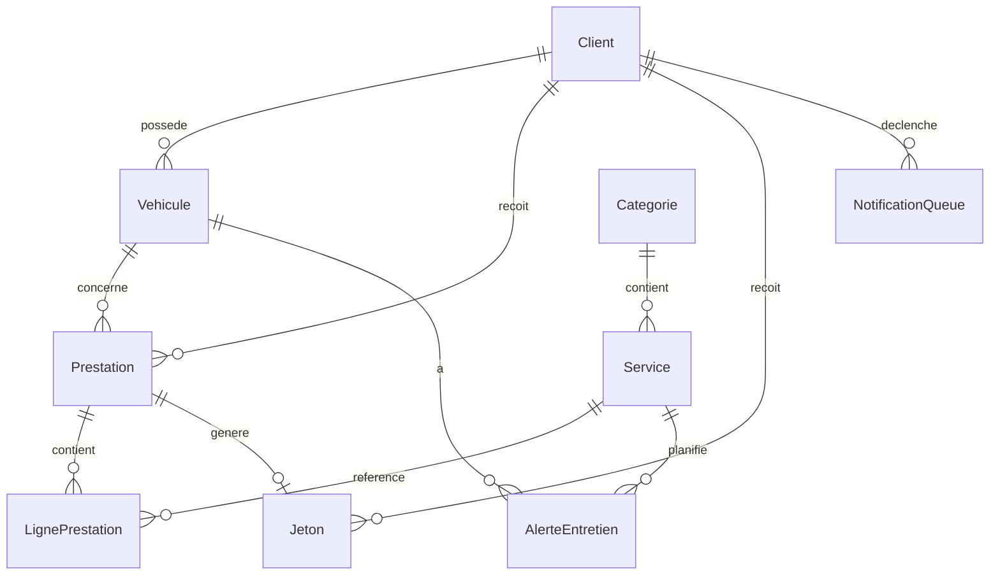

# Architecture technique — Application de gestion de garage automobile

## 1. Stack technique

| Couche | Technologie | Rôle |
|--------|-------------|------|
| Framework mobile | **Flutter** (Dart) | UI Android + iOS |
| Base locale | **SQLite** via **drift** | Source de vérité locale, requêtes typées et réactives |
| Backend / sync | **Firebase** (Auth, Firestore, Cloud Functions) | Authentification, synchronisation, logique serveur, WhatsApp |
| État UI | **Riverpod** | Providers réactifs, injection de dépendances |
| Navigation | **go_router** | Routing déclaratif |
| Connectivité | **connectivity_plus** | Détection online / offline |
| QR code | **mobile_scanner** (lecture), **qr_flutter** (génération) | Scan client, scan/consommation jeton |
| Identifiants | **uuid** | UUID v4 générés côté client |
| Internationalisation | **flutter_localizations** + **intl** | FR / EN, défaut = langue du device |
| Auth | **firebase_auth** | Email + mot de passe |

---

## 2. Principes architecturaux

### 2.1 Offline-first

- **SQLite (drift) est la source de vérité locale.**
- L'UI lit et écrit **toujours** via SQLite en premier.
- L'UI observe des **streams réactifs** (drift `watch`) pour se mettre à jour immédiatement.
- Firebase / Firestore est une **couche de synchronisation**, pas la source primaire pendant l'usage.
- Les opérations métier restent disponibles **sans connexion**.
- La synchronisation **bidirectionnelle** est active dès le MVP.

### 2.2 Organisation feature-first + Repository

Chaque feature est structurée en trois couches :

```
feature/
├── data/          # DAOs drift, datasources Firestore, implémentations repository
├── domain/        # Entités, interfaces repository, use cases
└── presentation/  # Écrans, widgets, providers Riverpod
```

**Règle de découplage :** la couche `presentation` ne connaît que le `domain`. Elle ignore SQLite, drift et Firestore.

### 2.3 Schéma des couches

```
┌─────────────────────────────────────────┐
│           Presentation (Riverpod)        │
│         Écrans · Widgets · Providers     │
└──────────────────┬──────────────────────┘
                   │ use cases / repositories (interfaces)
┌──────────────────▼──────────────────────┐
│                  Domain                  │
│      Entités · Interfaces · Use cases    │
└──────────────────┬──────────────────────┘
                   │
┌──────────────────▼──────────────────────┐
│                   Data                   │
│   Drift DAOs · Firestore · Repos impl.   │
└──────────────────┬──────────────────────┘
         ┌─────────┴─────────┐
         ▼                   ▼
    SQLite (local)      Firestore (remote)
```

### 2.4 Single-garage

- Un seul garage pour le MVP.
- L'ID garage est **fixe en configuration** (constante ou fichier de config).
- Toutes les collections Firestore sont scoped sous `/garages/{garageId}/`.

---

## 3. Authentification

- **Firebase Auth** avec email + mot de passe.
- L'accès à l'application requiert une connexion valide.
- Route guard via `go_router` : redirection vers l'écran de login si non authentifié.
- Pas de gestion fine des rôles en MVP (profil admin implicite une fois connecté).

---

## 4. Stratégie de synchronisation

### 4.1 Métadonnées communes (entités synchronisables)

| Champ | Type | Description |
|-------|------|-------------|
| `id` | `String` (UUID) | Identifiant unique, généré côté client |
| `createdAt` | `DateTime` | Date de création |
| `updatedAt` | `DateTime` | Dernière modification (base du LWW) |
| `isDeleted` | `bool` | Soft delete |
| `isDirty` | `bool` | En attente de push vers Firestore |

### 4.2 Flux d'écriture (push)

```
Action utilisateur
  → Écriture SQLite (isDirty = true)
  → UI mise à jour immédiatement (stream drift)
  → SyncService détecte connexion
  → Push des enregistrements isDirty vers Firestore
  → isDirty = false en local après succès
```

### 4.3 Flux de lecture (pull)

```
Reconnexion réseau
  → SyncService interroge Firestore (filtre updatedAt > lastSyncAt)
  → Fusion dans SQLite (last-write-wins sur updatedAt)
  → UI réactive via streams drift
```

### 4.4 Résolution de conflits

- Stratégie MVP : **last-write-wins (LWW)** basée sur `updatedAt`.
- En cas d'égalité de timestamp : privilégier la version **distante**.

### 4.5 File d'attente notifications (outbox pattern)

```
App mobile crée NotificationQueue en SQLite (isDirty = true)
  → Sync vers collection Firestore dédiée
  → Cloud Function onCreate / onWrite
  → Appel API WhatsApp Cloud (template pré-approuvé Meta)
  → Mise à jour statut côté serveur (sent / failed)
  → Pull statut vers app (optionnel MVP)
```

L'application **n'appelle jamais** l'API WhatsApp directement.

Types de notification :
- `welcome` — bienvenue à l'inscription (une fois)
- `reminder_j2` — rappel entretien 2 jours avant échéance
- `reminder_j0` — rappel entretien le jour J

---

## 5. Modèle de données (MVP)

### 5.1 Entités

#### Client

| Champ | Type | Notes |
|-------|------|-------|
| `id` | UUID | Contenu du QR code client |
| `phone` | String | E.164, unique |
| `nom` | String | |
| `prenom` | String | Optionnel |
| `pointsFidelite` | int | Solde de points cumulés |
| + métadonnées sync | | |

#### Vehicule

| Champ | Type | Notes |
|-------|------|-------|
| `id` | UUID | |
| `clientId` | UUID | FK → Client |
| `immatriculation` | String | |
| `marque` | String | |
| `modele` | String | |
| `annee` | int | Optionnel |
| `kilometrage` | int | Optionnel |
| + métadonnées sync | | |

#### Categorie

| Champ | Type | Notes |
|-------|------|-------|
| `id` | UUID | |
| `nom` | String | ex. « Mécanique » |
| `ordre` | int | Ordre d'affichage |
| + métadonnées sync | | |

#### Service

| Champ | Type | Notes |
|-------|------|-------|
| `id` | UUID | |
| `categorieId` | UUID | FK → Categorie |
| `nom` | String | ex. « Changement des roues » |
| `prix` | double | Fixe, en USD |
| `intervalleJours` | int | Pour alertes entretien |
| + métadonnées sync | | |

> **Note :** pas de champ `intervalleKm` — supprimé du modèle.

#### Prestation

| Champ | Type | Notes |
|-------|------|-------|
| `id` | UUID | |
| `clientId` | UUID | FK → Client |
| `vehiculeId` | UUID | FK → Vehicule |
| `statut` | enum | `ouverte` \| `cloturee` |
| `dateOuverture` | DateTime | |
| `dateCloture` | DateTime | Nullable |
| `montantTotal` | double | USD, calculé à la clôture |
| `montantPointsDeduit` | double | USD, déduction fidélité |
| `pointsUtilises` | int | Points déduits à la clôture |
| `pointsGagnes` | int | Points gagnés (= nb services) |
| `kilometrage` | int | Optionnel |
| + métadonnées sync | | |

#### LignePrestation

| Champ | Type | Notes |
|-------|------|-------|
| `id` | UUID | |
| `prestationId` | UUID | FK → Prestation |
| `serviceId` | UUID | FK → Service |
| `quantite` | int | Défaut 1 |
| `prixUnitaire` | double | Copié du catalogue à l'ajout |
| `montantLigne` | double | quantite × prixUnitaire |
| + métadonnées sync | | |

#### Jeton

| Champ | Type | Notes |
|-------|------|-------|
| `id` | UUID | Contenu du QR code jeton |
| `prestationId` | UUID | FK → Prestation |
| `clientId` | UUID | FK → Client |
| `statut` | enum | `emis` \| `consomme` |
| `dateEmission` | DateTime | |
| `dateConsommation` | DateTime | Nullable |
| + métadonnées sync | | |

#### AlerteEntretien

| Champ | Type | Notes |
|-------|------|-------|
| `id` | UUID | |
| `vehiculeId` | UUID | FK → Vehicule |
| `serviceId` | UUID | FK → Service |
| `dateEcheance` | DateTime | Calculée : dernière intervention + intervalleJours |
| `statut` | enum | `active` \| `notifiee_j2` \| `notifiee_j0` \| `expiree` |
| + métadonnées sync | | |

#### NotificationQueue

| Champ | Type | Notes |
|-------|------|-------|
| `id` | UUID | |
| `clientId` | UUID | FK → Client |
| `telephone` | String | E.164, copié du client |
| `type` | enum | `welcome` \| `reminder_j2` \| `reminder_j0` |
| `payload` | JSON | Données template WhatsApp |
| `statut` | enum | `pending` \| `sent` \| `failed` |
| `alerteEntretienId` | UUID | Nullable, pour rappels |
| + métadonnées sync | | |

### 5.2 Relations

```
Client 1 ── N Vehicule
Client 1 ── N Prestation
Client 1 ── N Jeton
Client 1 ── N NotificationQueue

Categorie 1 ── N Service

Vehicule 1 ── N Prestation
Vehicule 1 ── N AlerteEntretien

Prestation 1 ── N LignePrestation
Prestation 1 ── 1 Jeton

LignePrestation N ── 1 Service
AlerteEntretien N ── 1 Service
AlerteEntretien N ── 1 Vehicule
```

### 5.3 Diagramme entité-relation



### 5.4 QR codes

| QR | Contenu | Usage |
|----|---------|-------|
| **Client** | UUID du client | Scan à l'accueil → ouverture prestation |
| **Jeton boisson** | UUID du jeton | Scan → vérification validité → consommation |

---

## 6. Règles de calcul (référence implémentation)

### 6.1 Points de fidélité

```
pointsGagnes = nombre de lignes de prestation (1 point / service)
soldeApresCloture = client.pointsFidelite + pointsGagnes - pointsUtilises

Conversion : 10 points = 1 service offert
Valeur d'un point = prix du service le moins cher applicable / 10
  (ou : pointsUtilises = floor(montantDeduit / (prixServiceRef / 10)))
```

### 6.2 Facture

```
montantBrut = Σ (ligne.quantite × ligne.prixUnitaire)
montantPointsDeduit = pointsUtilises × (valeurUnitairePoint)
montantTotal = montantBrut - montantPointsDeduit
TVA = 0 %
Devise = USD
```

### 6.3 Alerte entretien

```
dateEcheance = dateDerniereIntervention(service, vehicule) + service.intervalleJours

Notifications :
  - reminder_j2 : dateEcheance - 2 jours
  - reminder_j0 : dateEcheance
```

---

## 7. Features applicatives (MVP)

| Feature | Responsabilités |
|---------|-----------------|
| `auth` | Login / logout Firebase, guard routes |
| `clients` | CRUD, génération QR, recherche par téléphone, solde points |
| `vehicules` | CRUD, rattachement client, historique |
| `catalogue` | CRUD catégories et services |
| `prestations` | Ouverture (scan client), lignes, points, clôture, facture écran |
| `jetons` | Émission, affichage QR, scan validation/consommation |
| `fidelite` | Calcul points, conversion 10:1, déduction à la clôture |
| `alertes` | Calcul échéances, suivi statuts notification |
| `reporting` | Stats jour (prestations, CA USD) |
| `notifications` | File d'attente locale, sync |
| `settings` | Choix langue FR / EN |
| `sync` | Orchestration push/pull, connectivité |
| `core` | DB drift, routing, thème, i18n, utils, widgets partagés |

---

## 8. Arborescence de dossiers proposée

```
lib/
├── main.dart
├── app.dart                              # MaterialApp, ProviderScope, i18n
│
├── core/
│   ├── config/
│   │   └── app_config.dart               # garageId, constantes métier (10 pts, etc.)
│   ├── database/
│   │   ├── app_database.dart
│   │   ├── app_database.g.dart
│   │   ├── tables/                       # Définitions tables drift
│   │   └── converters/                   # Converters enum, DateTime
│   ├── sync/
│   │   ├── sync_service.dart
│   │   ├── sync_metadata.dart
│   │   └── connectivity_service.dart
│   ├── routing/
│   │   └── app_router.dart
│   ├── theme/
│   │   └── app_theme.dart
│   ├── l10n/
│   │   ├── app_fr.arb
│   │   └── app_en.arb
│   └── utils/
│       ├── uuid_generator.dart
│       ├── phone_formatter.dart          # E.164
│       ├── currency_formatter.dart       # USD
│       └── date_utils.dart
│
├── features/
│   ├── auth/
│   │   ├── data/
│   │   ├── domain/
│   │   └── presentation/
│   ├── clients/
│   │   ├── data/
│   │   │   ├── datasources/
│   │   │   ├── models/
│   │   │   └── repositories/
│   │   ├── domain/
│   │   │   ├── entities/
│   │   │   ├── repositories/
│   │   │   └── usecases/
│   │   └── presentation/
│   │       ├── providers/
│   │       ├── screens/
│   │       └── widgets/
│   ├── vehicules/
│   ├── catalogue/
│   ├── prestations/
│   ├── jetons/
│   ├── fidelite/
│   ├── alertes/
│   ├── reporting/
│   ├── notifications/
│   └── settings/
│
docs/
├── BUSINESS_LOGIC.md
└── ARCHITECTURE.md

firebase/                                 # (hors scope code app MVP)
├── functions/
└── firestore.rules
```

---

## 9. Navigation (MVP)

| Route | Écran | Auth |
|-------|-------|------|
| `/login` | Connexion email/password | Non |
| `/` | Dashboard / stats du jour | Oui |
| `/clients` | Liste clients | Oui |
| `/clients/new` | Création client | Oui |
| `/clients/:id` | Détail client + véhicules + points | Oui |
| `/clients/:id/qr` | Affichage QR client | Oui |
| `/vehicules/:id` | Détail véhicule + historique | Oui |
| `/catalogue` | Catégories et services | Oui |
| `/prestations/scan` | Scan QR client → ouverture | Oui |
| `/prestations/:id` | Prestation en cours (lignes, points, clôture) | Oui |
| `/prestations/:id/jeton` | Affichage QR jeton boisson | Oui |
| `/prestations/:id/facture` | Récap facture USD | Oui |
| `/jetons/scan` | Scan QR jeton → validation/consommation | Oui |
| `/alertes` | Liste alertes entretien | Oui |
| `/settings` | Paramètres (langue FR/EN) | Oui |

---

## 10. Internationalisation

- Langue par défaut : **langue du device**.
- Paramètres utilisateur : bascule **Français** / **Anglais**.
- Fichiers ARB : `lib/core/l10n/app_fr.arb`, `app_en.arb`.
- Formats :
  - Dates : locale-aware via `intl`.
  - Montants : **USD** (`$`), format `en_US` ou locale selon choix langue.

---

## 11. Dépendances Flutter (indicatif)

```yaml
dependencies:
  flutter:
    sdk: flutter
  flutter_localizations:
    sdk: flutter
  drift: ^latest
  sqlite3_flutter_libs: ^latest
  path_provider: ^latest
  path: ^latest
  flutter_riverpod: ^latest
  riverpod_annotation: ^latest
  go_router: ^latest
  connectivity_plus: ^latest
  mobile_scanner: ^latest
  qr_flutter: ^latest
  uuid: ^latest
  firebase_core: ^latest
  firebase_auth: ^latest
  cloud_firestore: ^latest
  intl: ^latest
  shared_preferences: ^latest   # persistance choix langue

dev_dependencies:
  drift_dev: ^latest
  build_runner: ^latest
  riverpod_generator: ^latest
  flutter_test:
    sdk: flutter
```

---

## 12. Firebase

| Composant | Rôle |
|-----------|------|
| Firebase Auth | Email + mot de passe |
| Firestore | Collections miroir des entités + `notification_queue` |
| Cloud Functions | Traitement file notifications → API WhatsApp Cloud |
| Blaze plan | Requis pour appels réseau sortants (WhatsApp) |

### Structure Firestore (single-garage)

```
/garages/{garageId}/
  clients/{clientId}
  vehicules/{vehiculeId}
  categories/{categorieId}
  services/{serviceId}
  prestations/{prestationId}
  ligne_prestations/{ligneId}
  jetons/{jetonId}
  alertes/{alerteId}
  notification_queue/{notifId}
```

---

## 13. Décisions techniques figées

| Décision | Valeur |
|----------|--------|
| Offline-first | SQLite (drift) source locale, sync bidirectionnelle Firestore |
| État | Riverpod |
| Navigation | go_router |
| Identifiants | UUID côté client |
| Conflits | Last-write-wins sur `updatedAt` |
| WhatsApp | Outbox locale → Firestore → Cloud Function |
| Architecture | Feature-first + Repository, 3 couches |
| Auth | Firebase email/password |
| Garage | Single-tenant, ID fixe |
| Devise | USD, TVA 0 % |
| Alertes | Jours uniquement (pas de km) |
| i18n | FR / EN, défaut device |
| Points | 1 service = 1 pt, 10 pts = 1 service offert |
