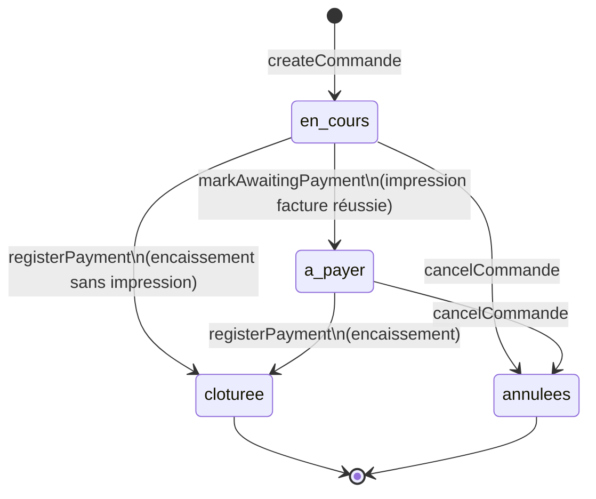

# Workflow — Feature Commandes (Restaurant)

Documentation du module `restaurant` : cycle de vie d'une commande, règles
métier, architecture technique (UI, repository, synchronisation) et
couverture de tests. Complète `ARCHITECTURE.md` et `BUSINESS_LOGIC.md` sans
les dupliquer.

---

## 1. Vue d'ensemble

Une **commande** représente une prise en charge client dans l'activité
restaurant (table, à emporter, livraison). Elle regroupe des **lignes de
commande** (produits + quantités) et traverse un cycle de statuts strict,
de l'ouverture jusqu'à l'encaissement.

| Terme | Définition |
|-------|------------|
| **Commande** | Ensemble de lignes rattaché à un contexte (table, livraison…) et à un client optionnel, avec un montant total calculé. |
| **Ligne de commande** | Produit du catalogue ajouté à une commande, avec quantité et prix figé au moment de l'ajout. |
| **Statut** | Position de la commande dans son cycle de vie — voir §2. |

---

## 2. Cycle de vie et statuts



| Statut (clé) | Libellé UI | Déclencheur | Modifiable ? | Annulable ? |
|---|---|---|---|---|
| `en_cours` | En cours | Création de la commande | Oui (seul statut modifiable) | Oui |
| `a_payer` | À payer | Impression réussie de la facture | Non | Oui |
| `cloturee` | Clôturée | Paiement encaissé | Non | **Non** |
| `annulees` | Annulée | Annulation manuelle | Non | — (déjà annulée) |

Constantes centralisées dans `CommandeStatus`
(`lib/features/restaurant/domain/entities/commande_entity.dart`) — jamais de
chaîne magique ailleurs dans le code.

### Règles impératives

1. **`en_cours` est le seul statut modifiable** : ajout/retrait de ligne,
   attache/détache client. Toute tentative sur un autre statut lève un
   `StateError` explicite (`_requireEditableCommande`).
2. **Impression de facture** → transition `en_cours → a_payer`
   (idempotente si déjà `a_payer`). Une commande `cloturee` reste
   imprimable (réimpression), sans changement de statut.
3. **Encaissement** → transition vers `cloturee`, **directement depuis
   `en_cours`** si le client paie sans qu'une facture ait été imprimée, ou
   depuis `a_payer`. Idempotent si déjà `cloturee`.
4. **Annulation** possible depuis `en_cours` ou `a_payer` uniquement — une
   commande `cloturee` ne peut plus jamais être annulée. L'annulation
   restaure le stock de toutes les lignes.
5. Toutes les gardes vivent dans le repository
   (`CommandeRepositoryImpl`, `lib/features/restaurant/data/repositories/`),
   pas dans l'UI — la même règle s'applique quel que soit l'appelant.

---

## 3. Architecture (3 couches)

```
lib/features/restaurant/
├── domain/
│   ├── entities/commande_entity.dart        # CommandeEntity, CommandeStatus, helpers d'éligibilité
│   ├── entities/ligne_commande_entity.dart
│   └── repositories/commande_repository.dart # Contrat abstrait
├── data/
│   └── repositories/commande_repository_impl.dart  # Drift + gardes métier
└── presentation/
    ├── providers/commande_providers.dart     # Riverpod : streams + CommandeController
    └── screens/
        ├── new_commande_screen.dart          # Création (choix de table)
        └── commande_detail_screen.dart        # Détail (onglets Produits / Détails)
```

`CommandeEntity` expose des getters d'éligibilité pour éviter les
comparaisons de chaînes dans l'UI :

```dart
commande.isEditable         // statusKey == en_cours
commande.canBeCanceled      // en_cours ou a_payer
commande.canCollectPayment  // en_cours ou a_payer
commande.isClosed           // cloturee
commande.isCanceled         // annulees
```

### Repository (`CommandeRepositoryImpl`)

| Méthode | Effet |
|---|---|
| `createCommande` | Crée la commande au statut `en_cours`, référence `CMD-xxxxx` générée. |
| `addProduitLine` / `removeLine` / `decrementLine` | Modifie les lignes (garde : `en_cours` uniquement), décrémente/restaure le stock produit si suivi activé, recalcule `montantTotal`. |
| `attachClient` / `detachClient` | Rattache un client (garde : `en_cours` uniquement). |
| `cancelCommande` | Annule + restaure le stock de toutes les lignes (garde : pas `cloturee`). |
| `markAwaitingPayment` | `en_cours → a_payer`. |
| `registerPayment` | `(en_cours \| a_payer) → cloturee`. |

### Controller (`CommandeController`, Riverpod `AsyncNotifier`)

Chaque méthode : vérifie `canCreateActivitiesProvider`, délègue au
repository, puis appelle `autoSyncCoordinatorProvider.schedulePush()` pour
planifier la synchronisation (voir §5).

---

## 4. Écrans et parcours UI

### 4.1 Création — `NewCommandeScreen`

Route : `/commandes/new`. Sélection de table optionnelle (sélecteur en
feuille modale, style réutilisé pour la recherche client — voir 4.3) puis
`createCommande()` → navigation vers `/commandes/:id`.

### 4.2 Détail — `CommandeDetailScreen`

Route : `/commandes/:id`. Deux onglets, une **barre d'actions unique**
partagée (`_ActionsBar`) affichée en bas quel que soit l'onglet actif :

| Élément | Comportement |
|---|---|
| Total + badge « Payée » | Badge visible seulement si `isClosed`. |
| Bouton **Imprimer facture** | Toujours visible (y compris commande clôturée). |
| Bouton **Encaisser paiement** | Visible seulement si `canCollectPayment`. |

Header (coin droit) : icône Imprimer → icône Encaisser (si éligible) →
menu (⋯) avec *Imprimer*, *Encaisser le paiement* (si éligible), *Annuler
la commande* (si `canBeCanceled`).

**Onglet Produits** : liste des lignes, stepper quantité, feuille
« Ajouter un produit » (recherche + filtre catégorie + quantité).

**Onglet Détails** : rattachement client par recherche téléphone
**inline** — suggestions affichées en direct pendant la saisie (pas de
bouton « Rechercher » séparé), même traitement visuel que le sélecteur de
table de `NewCommandeScreen`. Tap sur une suggestion → attache + vide le
champ.

### 4.3 Popup impression

`confirmPrintInvoice()` (`lib/features/printing/presentation/utils/invoice_print_flow.dart`)
affiche l'imprimante actuellement sélectionnée et son état de connexion
avant de lancer l'impression réelle. Si aucune imprimante n'est
configurée, affiche le message et propose d'aller aux réglages — le
bouton *Imprimer* est masqué dans ce cas. Un print réussi déclenche
`markAwaitingPayment` si la commande était `en_cours`.

### 4.4 Popup encaissement

Affiche le montant total, bouton **« Argent encaissé »** → `registerPayment`
→ célébration : haptique + confettis (`confetti`) + son de succès
synthétisé localement (`audioplayers`, asset `public/audio/cash_success.wav`,
aucune dépendance réseau) + SnackBar de confirmation.

---

## 5. Synchronisation (offline-first)

Écriture locale (Drift/SQLite) **toujours immédiate** ; la synchro cloud
suit, avec ou sans connexion.

### 5.1 Adaptateurs

`CommandeSyncAdapter` et `LigneCommandeSyncAdapter`
(`lib/core/sync/sync_registry.dart`) traduisent les lignes Drift `isDirty`
vers `establishments/{id}/commandes` et `establishments/{id}/ligne_commandes`
sur Firestore, et appliquent les documents distants en local (résolution
de conflit : *last-write-wins* sur `updatedAt`, une ligne locale `isDirty`
plus récente n'est jamais écrasée).

### 5.2 Déclencheurs (`AutoSyncCoordinator`)

| Déclencheur | Détail |
|---|---|
| Écriture locale | `schedulePush()` appelé après chaque mutation du controller — débounce 1,5 s (regroupe les écritures rapprochées). |
| Retour de connectivité | Débounce 2 s. |
| Retour au premier plan | Si en ligne au moment de la reprise. |
| **Écoute Firestore temps réel** | Un changement confirmé par un *autre* appareil du même établissement (ex. plusieurs serveurs) déclenche un pull en quelques secondes, sans attendre le filet de sécurité. |
| Filet de sécurité | Toutes les 5 min si en ligne. |
| Échec de synchro | Backoff exponentiel (5 s → 5 min max), nouvelle tentative automatique. |

Toute erreur de cycle (règles Firestore, réseau, Firebase non initialisé…)
est **journalisée** (`debugPrint('[Sync] ...')`) plutôt qu'avalée en
silence — jamais remontée comme erreur fatale (`FlutterError.reportError`
aurait cassé le caractère « récupérable » de ces échecs).

---

## 6. Tests

| Fichier | Portée |
|---|---|
| `test/restaurant/commande_repository_test.dart` | Logique métier pure : création, lignes, stock, cycle de statuts complet, toutes les gardes. |
| `test/restaurant/commande_detail_interactions_test.dart` | Interactions UI réelles (taps) sur une commande pré-créée : onglets, recherche client, popups impression/encaissement. |
| `test/restaurant/commande_lifecycle_e2e_test.dart` | Parcours complet depuis l'écran liste : création → produit → client → impression → encaissement → retour liste à jour. |
| `test/sync/commande_sync_adapter_test.dart` | Mapping des champs, dirty-tracking, résolution de conflit pour les deux adaptateurs. |
| `test/sync/commande_status_sync_e2e_test.dart` | Un changement de statut réel (UI) se pousse vers Firestore automatiquement. |
| `test/sync/multi_device_realtime_sync_test.dart` | Deux appareils indépendants, un Firestore partagé : propagation quasi temps réel sans action locale du second appareil. |

### Limitation connue (hors périmètre)

Le sélecteur rapide de statut accessible par appui long sur une carte
(liste principale, `activity_card_actions_sheet.dart`) ne modifie qu'un
état local factice (`activityListProvider`) — il ne persiste **pas** en
base et n'a aucun effet sur le vrai cycle de statuts décrit ici.
