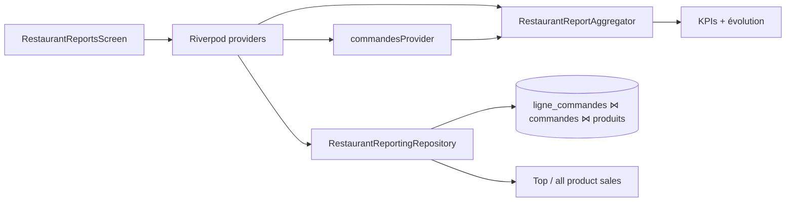

# Feature — Rapports (Restaurant)

Documentation du module `reporting` pour les établissements **Restaurant** :
écran d’aperçu d’activité, règles d’agrégation, architecture et couverture
de tests. Complète `ARCHITECTURE.md` et `BUSINESS_LOGIC.md` sans les
dupliquer.

> **Périmètre actuel** : UI maquette et agrégations branchées uniquement
> pour `BusinessCategory.restaurant`. Les autres métiers conservent le stub
> historique (`DashboardScreen` — stats jour à brancher plus tard).

---

## 1. Vue d’ensemble

L’onglet **Rapports** (`/rapports`) donne un aperçu de l’activité sur une
période sélectionnable :

| Bloc | Contenu |
|------|---------|
| En-tête | Titre « Rapports », sous-titre « Aperçu de votre activité » |
| Filtre de période | Aujourd’hui / Hier / 7 j. / 30 j. / plage personnalisée |
| KPIs | CA, Commandes, Panier moyen, Clients servis (+ variation vs période précédente) |
| Graphique | Évolution journalière du chiffre d’affaires (barres) |
| Répartition | Top produits de la catégorie sélectionnée + bottom sheet « voir tous » |

La bottom navigation de l’app (shell) n’est **pas** redessinée ici : elle
reste fournie par `PrimaryScaffold`.

---

## 2. Règles métier

Toutes les agrégations filtrent sur `CommandeEntity.createdAt` dans la
plage `[start, end)` (`ReportDateRange`).

| Indicateur | Source | Filtre |
|---|---|---|
| **Chiffre d’affaires** | `totalAmount` | Statut `cloturee` uniquement |
| **Commandes** | nombre de commandes | Statut ≠ `annulees` |
| **Panier moyen** | CA / nb commandes clôturées | 0 si aucune clôturée |
| **Clients servis** | `clientId` distincts non vides | Sur les commandes non annulées |
| **Évolution CA** | CA journalier | Commandes `cloturee` |
| **Ventes produit** | Somme des `quantite` des lignes | Commandes `cloturee` + catégorie optionnelle |

### Comparaison « vs période précédente »

Pour une plage de durée `D`, la période précédente est
`[start - D, start)`. Exemple : « Aujourd’hui » → hier.

- Variation en % : `((actuel - précédent) / précédent) × 100`
- Si précédent = 0 et actuel > 0 → variation **indéfinie** (`null`, affichée « — »)
- Si les deux sont 0 → `0 %`

### Devise

Affichage des montants en **CDF** (format français `1 850 000 CDF`),
aligné sur la maquette. Les montants stockés restent des `double` sans
colonne devise sur les commandes.

---

## 3. Architecture

```
lib/features/reporting/
├── domain/
│   ├── entities/
│   │   ├── report_date_range.dart          # Plages + presets
│   │   ├── restaurant_report_kpis.dart
│   │   ├── revenue_evolution_point.dart
│   │   └── product_sales_item.dart
│   ├── services/
│   │   └── restaurant_report_aggregator.dart  # KPIs + évolution (purs)
│   └── repositories/
│       └── restaurant_reporting_repository.dart
├── data/
│   └── repositories/
│       └── restaurant_reporting_repository_impl.dart  # Jointures Drift
└── presentation/
    ├── providers/restaurant_report_providers.dart
    ├── screens/
    │   ├── dashboard_screen.dart           # Branche restaurant vs stub
    │   └── restaurant_reports_screen.dart
    ├── theme/report_colors.dart            # Accents maquette (rouge…)
    └── widgets/
        ├── report_date_range_selector.dart
        ├── restaurant_report_kpi_grid.dart
        ├── revenue_evolution_chart.dart    # fl_chart
        ├── product_sales_breakdown_card.dart
        ├── product_sales_list.dart
        └── all_category_products_sheet.dart
```

### Flux de données



- **KPIs / évolution** : calculés en mémoire depuis le stream des commandes
  déjà chargé (`commandesProvider`) — pas de requête SQL dédiée.
- **Ventes par produit** : jointure Drift réactive
  (`watchProductSales`), filtrée par établissement, période, statut
  `cloturee` et `categoryId` optionnel.

### Navigation

| Route | Widget | Condition |
|---|---|---|
| `/rapports` (`Routes.reports`) | `DashboardScreen` | Toujours |
| └─ | `RestaurantReportsScreen` | `activeBusinessCategoryProvider == restaurant` |
| └─ | Stub 2 cartes | Autres métiers |

---

## 4. UI / UX (maquette)

- Couleurs d’accent **rouges** (`ReportColors`) pour charts, liens et
  pastille calendrier — volontairement alignées sur la maquette, distinctes
  du violet brand restaurant du shell.
- Icônes KPI multicolores (vert / bleu / orange / violet).
- Sélecteur de catégorie : chip « Plats » (ou première catégorie catalogue)
  → bottom sheet de choix.
- « Voir tous les produits de la catégorie » → bottom sheet élargi (~85 %
  hauteur) listant le classement complet.
- Produits sans image catalogue → placeholder `Icons.restaurant_menu_rounded`.

Dépendance chart : `fl_chart`.

---

## 5. Providers clés

| Provider | Rôle |
|---|---|
| `reportDateRangeProvider` | Période active (défaut : aujourd’hui) |
| `restaurantReportKpisProvider` | KPIs + variations |
| `revenueEvolutionProvider` | Points journaliers CA |
| `selectedReportCategoryIdProvider` | Catégorie choisie (`null` → première) |
| `effectiveReportCategoryProvider` | Catégorie effective |
| `topProductSalesProvider` | Top 5 |
| `allProductSalesProvider` | Classement complet (sheet) |

---

## 6. Tests

| Fichier | Portée |
|---|---|
| `test/reporting/report_date_range_test.dart` | Presets, `previous`, `contains`, plage custom |
| `test/reporting/restaurant_report_aggregator_test.dart` | KPIs, exclusions annulées, panier, évolution, % |
| `test/reporting/restaurant_reporting_repository_test.dart` | Agrégat Drift ventes produit + filtre catégorie |
| `test/reporting/restaurant_reports_e2e_test.dart` | Parcours UI : écran, KPIs, catégorie, sheet « voir tous », filtre période |

Lancer uniquement le module :

```bash
flutter test test/reporting/
```

---

## 7. Limites connues / suite

- Stub multi-métier (garage, etc.) non enrichi.
- Pas d’image produit en base → placeholder uniquement.
- CA basé sur `createdAt` de la commande clôturée (pas sur un
  `paidAt` dédié).
- Pas de reporting cloud / email journalier (hors périmètre MVP mobile).
